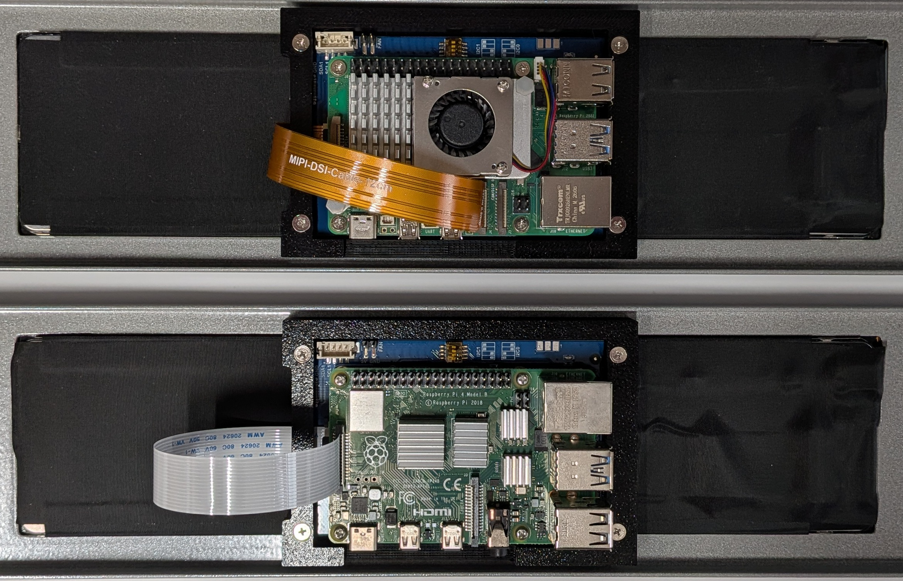

# Waveshare 11.9" DSI LCD Setup

## Raspberry Pi 4B and Raspberry Pi 5

**OS:** Raspberry Pi OS / Debian Trixie with Wayland desktop

This guide documents the setup for the Waveshare 11.9" DSI LCD on both the Raspberry Pi 4 Model B and Raspberry Pi 5.

---

## 1. Physical Connection



### Raspberry Pi 4B

Connect the Waveshare 11.9" DSI LCD to the Pi 4B’s **DISPLAY/DSI** ribbon connector.

Do **not** use the camera connector.

The display’s **four-wire power/I²C connection** is normally made through the Waveshare spring pins if the Pi is mounted directly onto the screen.

If the screen does not work even though the software configuration is correct, check the physical spring-pin contact. In my case, the GPIO contact area needed gentle cleaning with a nail file to get reliable contact.

---

### Raspberry Pi 5

Use the Pi 5 connector marked:

```text
CAM/DISP 1
```

Waveshare and the internet generally recommends **DSI1** for this display on the Pi 5.

The display’s **four-wire power/I²C connection** is normally made through the Waveshare spring pins if the Pi is mounted directly onto the screen.

If the screen does not work even though the software configuration is correct, check the physical spring-pin contact. In my case, the GPIO contact area needed gentle cleaning with a nail file to get reliable contact.

---

## 2. SSH Into the Raspberry Pi

SSH into the device after it has booted.

Example:

```bash
ssh david@<pi-address>
```

Replace `<pi-address>` with the hostname or IP address of the Raspberry Pi.

---

## 3. Edit the Raspberry Pi Boot Config

Open the boot configuration file:

```bash
sudo nano /boot/firmware/config.txt
```

Find the existing `[all]` section.

Under `[all]`, add the following lines:

```ini
# Raspberry Pi KMS graphics
dtoverlay=vc4-kms-v3d

# Waveshare 11.9" DSI LCD
dtoverlay=vc4-kms-dsi-waveshare-panel,11_9_inch
```

The final section should look similar to this:

```ini
[all]
# Raspberry Pi KMS graphics
dtoverlay=vc4-kms-v3d

# Waveshare 11.9" DSI LCD
dtoverlay=vc4-kms-dsi-waveshare-panel,11_9_inch
```

Save and exit:

```text
Ctrl+O
Enter
Ctrl+X
```

Then reboot:

```bash
sudo reboot
```

---

## 4. Do Not Use Boot-Level Rotation

Do **not** add rotation settings to `/boot/firmware/cmdline.txt`.

Do **not** add this:

```text
video=DSI-1:320x1480M@60,rotate=270
```

Also do **not** use rotation on the Waveshare overlay line in `config.txt`.

Do **not** use this:

```ini
dtoverlay=vc4-kms-dsi-waveshare-panel,11_9_inch,rotation=270
```

For Raspberry Pi OS / Debian Trixie with Wayland desktop, rotation and scaling should be done through the desktop display settings.

---

## 5. Enable VNC

SSH back into the Raspberry Pi and run:

```bash
sudo raspi-config
```

Navigate to:

```text
Interface Options
VNC
Yes
Finish
```

Then reboot:

```bash
sudo reboot
```

On Trixie with Wayland, this enables the Wayland-compatible VNC service.

You should then be able to connect to the Raspberry Pi using VNC.

---

## 6. Rotate and Scale the Screen in the Desktop

Connect to the Raspberry Pi using VNC.

Then go to:

```text
Preferences
Control Centre
Screens
```

Select the Waveshare DSI display.

Change the screen rotation until it is correct.

For my physical mounting, the correct rotation was equivalent to:

```bash
wlr-randr --output DSI-1 --transform 90
```

However, the preferred method is to set rotation in the GUI rather than relying on the command line.

If the mouse behaves strangely after changing the rotation, close the VNC session and reconnect. It should then behave normally.

---

## 7. Apply Small-Screen Defaults

In Control Centre, go to:

```text
Defaults
```

Press:

```text
Set Defaults
For Small Screens
```

This makes menus, panels, and UI elements easier to use on the narrow Waveshare screen.

If the mouse behaves strangely after applying the change, close the VNC session and reconnect.

---

## Final Recommended Configuration

For both the **Raspberry Pi 4B** and **Raspberry Pi 5**, the clean final `/boot/firmware/config.txt` setup is:

```ini
[all]
# Raspberry Pi KMS graphics
dtoverlay=vc4-kms-v3d

# Waveshare 11.9" DSI LCD
dtoverlay=vc4-kms-dsi-waveshare-panel,11_9_inch
```

Rotation and scaling should then be configured natively through the desktop:

```text
Preferences → Control Centre → Screens
```

This is the cleanest setup for Raspberry Pi OS / Debian Trixie with Wayland.
